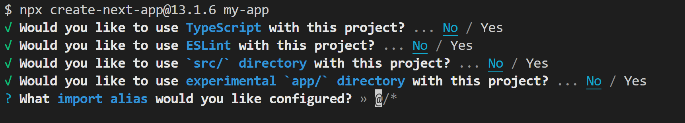

# Project Initialzers

This repository contains bash files to quickly skip all install processes by running a single command

## General System Requirements:

1. Npm and Node.js must be installed
2. Should be run on a linux terminal
3. Configured on bash terminal
4. Have Git installed (optional)
5. Have vs-code installed and added to path (optional)

## Tailwind Initializer

The **tailwind.sh** file runs all the necessary tailwind commands so you can immediately start your project

### How to use

1. Create a new project folder (`mkdir example-project`)
2. Enter the newly created folder (`cd example-project`)
3. Copy the **tailwind.sh** into the new folder
4. Run `bash tailwind.sh` in that folder

### What the command does

1. Installs tailwind css
2. Installs prettier for tailwind
3. Creates all necessary html, css and js files
4. Creates "build" and "watch" commands in package.json file
5. Links index.html to the created css and js files
6. Links tailwind.config file to watch all html files in that folder
7. If git is installed, then it initializes a new repository
8. If VsCode is installed then it opens the folder

## React Initializer with Vite and TailwindCSS

The `react-vite-tailwind.sh` file runs all commands to immediately start a react application with tailwind automatically configured

### How to use

1. Copy the `react-vite-tailwind.sh` into a folder on your machine (I would call this the `parent`)
2. Create a new project folder inside the parent folder (`mkdir new-project`)
3. Enter the newly created folder (`cd new-project`)
4. Run `bash ../react-vite-tailwind.sh` in that folder.
   The default configuration is Javascript but if you want to use typescript then add the `ts` param to the command
   `bash ../react-vite-tailwind.sh ts`

### What the command does

1. Creates a React application using vite (javascript or typescript template as specified)
2. Install TailwindCSS and the necessary config packages
3. Install prettier plugin for tailwind
4. Configures both tailwind and prettier
5. Replaces the default `App` source code with `hello world`
6. If git is installed, then it initializes a new repository
7. If VsCode is installed then it opens the folder

## NextJs Initializer with TailwindCSS

The **next-tailwind.sh** initilizes a NextJs project with tailwind installed. The program installs `NextJs` version `13.1.6`. <!-- This is because it has been designed to work properly to by-pass the CLI prompts of this version.--> <br/> By default, this project is made to be Non-interactive so you won't see any of these prompts <br><br>

This would be updated depending on the changes made in future NextJs version

### How to Use

This also has a similar procedure as `react-vite-tailwind.sh`

1. Copy the `next-tailwind.sh` into a folder on your machine (I would call this the `parent`)
2. Create a new project folder inside the `parent` folder (`mkdir new-project`)
3. Enter the newly created folder (`cd new-project`)
4. Run `bash ../next-tailwind.sh [options]`

```
Options:

Initialize as a typescript project ( default:  javascript )
ts

Initialize with eslint config ( default: no eslint )
lint

Initialize as a `app/` directory project ( default: without app directory )
app

Initialize inside a `src/` directory( default: without src folder )
src

Explicitly tell the CLI to bootstrap the app using pnpm ( default: uses npm )
pnpm

By default  the import alias is "@/*" and this behaviour cannot be changed
```

**Note:** Any missing option would make use of the default. All and any parameter could be eliminated and also there's no specified ordering for them

### Example commands:

- `bash next-tailwind.sh app ts lint`
- `bash next-tailwind.sh src pnpm ts`
- `bash next-tailwind.sh `

### What the Command does

1. Creates a NextJs version 13.1.6 application using the specified configurations
2. Install TailwindCSS and the necessary config packages
3. Install prettier plugin for tailwind
4. Configures both tailwind and prettier
5. Replaces the default `App` code with `hello world`
6. If git is installed, then it initializes a new repository
7. If VsCode is installed then it opens the folder

## Tip

One good idea is to copy these files into the root (`~` in bash) of the machine. This way you don't have to worry about any parent or child and would just run

```
bash ~/<script-name>
```

in any folder and it would work as expected. The scripts would be accessible globally
